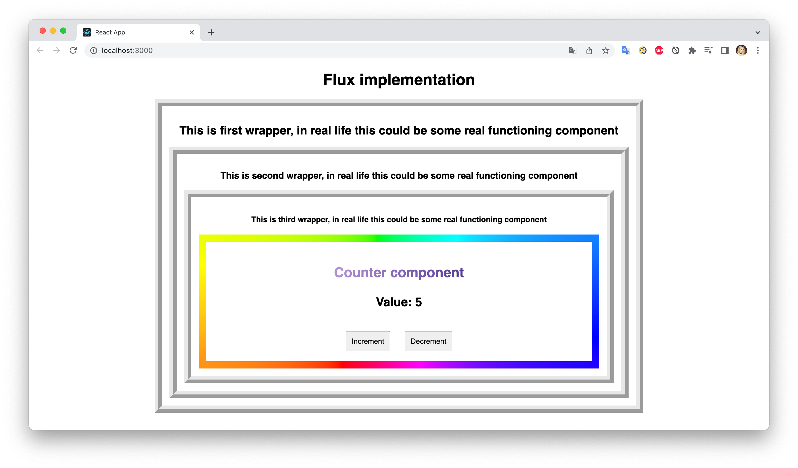

# Реализация паттерна Flux на языке JS

Пример использования паттерна на интерфейсе с множеством вложенных компонентов для избежания ситуации под названием "props drilling"

**Props drilling** - анти-паттерн при котором передача пропсов происходит через промежуточные компоненты которые не используют получаемые пропсы, а только передают их в следующие компоненты.

В данном случае самым вложенным компонентом является Counter - его состояние передается вниз через компоненты Wrapper1, Wrapper2 и Wrapper3, которые не нуждаются в лишних пропсах.